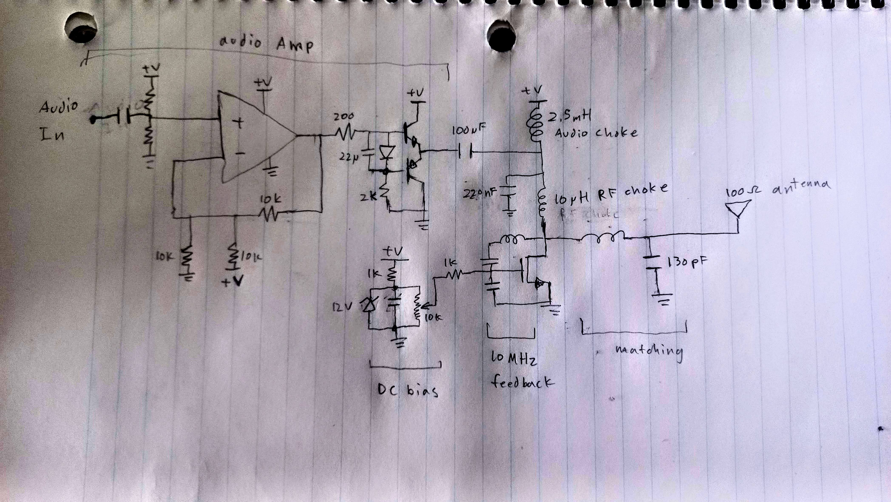
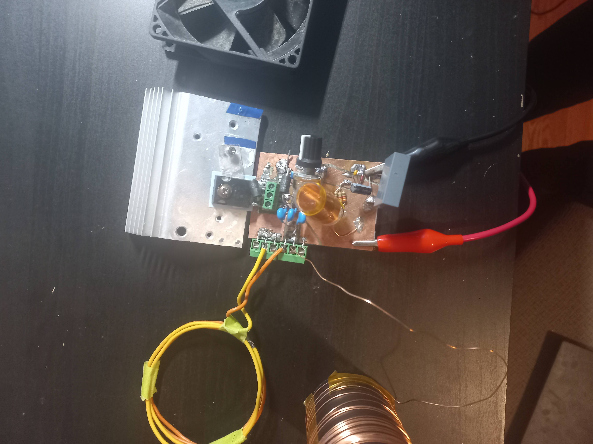

copper clad board:
pros: 
- easy and cheap for initial prototype
Cons
- Difficult to modify/ rework
- faulty connections
- arcing between traces
- heat sink is janky - rips the mosfet off the board

# PCB!!

### Use case configurations
- Plasma toroid:
    - 24V barrel input
    - audio amp unpopulated - Audio choke shorted
    - Antenna 2 unused
    - Biased by V+
    - Big holes for resonating coil
- PLasma flame speaker
    - 40V input
    - audio amp populated
    - 12V for fan, Bias
    - use antenna 1 
- Radio Transmitter
    - 30V input
    - audio amp populated
    - use antenna 2

### Features:
- connections
    - power connection: barrel or alligator
    - 12V VCC input (barrel)
    - 12V output for fan (barrel)
    - audio choke holes (space for terminal jack)
- Test points:
    - +12V
    - audio in
    - audio amp out
    - Gate (pin1, D2, C23)
    - Drain (pin2, massive holes)
- Mods:
    - Bias from +12V or V+ (0R/ DNP)
    - series HV cap option
    - drain capacitor option

### Cosmedics:
- symmetric
- labeled blocks
- engraved names on front
- silk names on back
- waywayway on back
- NO LEDS

### Project:
- PCB
- Add product number
- Add drain -source capacitor
- Order
- BOM  - order
- Ali order:

- High current coil (copper tube)
- Xenon bulb
- 7Meg antenna

### Budget
- PCBway    19.38
- Ali1      45.50 + 14.00

- Digikey   41.70 + 8.00
- tube      20
- bulb      130

